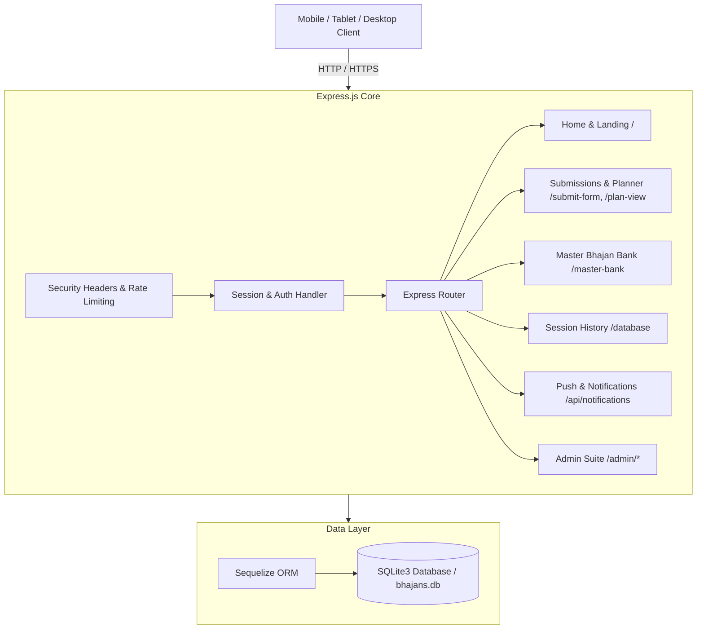

# 🕉️ Bhajan Scheduler

[](https://nodejs.org/)
[](https://expressjs.com/)
[](https://www.sqlite.org/)
[](#-pwa--offline-capabilities)
[](#-deployment-railway)
[](LICENSE)

> A modern, high-performance Progressive Web Application (PWA) for scheduling, organizing, and managing devotional bhajan sessions for the **Sri Sathya Sai Seva Organisation, Gandhinagar**.

---

## 📌 Table of Contents

- [Overview](#-overview)
- [Key Features](#-key-features)
- [Tech Stack](#-tech-stack)
- [Application Architecture](#-application-architecture)
- [Directory Structure](#-directory-structure)
- [Quick Start](#-quick-start)
- [Environment Variables](#-environment-variables)
- [Route Navigation Map](#-route-navigation-map)
- [PWA & Offline Capabilities](#-pwa--offline-capabilities)
- [iOS & Mobile Performance Optimizations](#-ios--mobile-performance-optimizations)
- [Security & Rate Limiting](#-security--rate-limiting)
- [Deployment (Railway)](#-deployment-railway)
- [Contributing](#-contributing)
- [License](#-license)

---

## 🕉️ Overview

**Bhajan Scheduler** streamlines the planning and curation of weekly Thursday and special devotional bhajan sessions. It provides an intuitive public portal for singers and devotees to mark their bhajan preferences, implements automated deity sequencing rules, offers an extensive searchable bank of 3,000+ master bhajans, tracks singer participation, supports web push notifications, and works seamlessly offline as an installable app across iOS, Android, and Desktop devices.

---

## ✨ Key Features

### 📋 Devotee Submissions & Live Plan
- **Singer's Zone (`/submit-form`)**: Interactive submission interface for devotees to select and register bhajans from the master catalog for upcoming sessions.
- **Live Program Plan (`/plan-view`)**: Real-time overview of finalized song orders, tempos, deities, and scales for singers and harmonium/tabla accompanists.

### 📚 Master Bhajan Bank (3,000+ Bhajans)
- **Centralized Catalog (`/master-bank`)**: Curated library of 3,000+ bhajans with deity, raga, tempo, pitch/scale (male & female, Indian and Western notations), difficulty level, and language.
- **Instant Search & Interactive Filters**: Real-time in-memory search by title, deity, tempo, and raga executed in `<2ms` with zero DOM freeze.
- **Progressive Chunk Rendering**: Memory-optimized progressive rendering to ensure smooth browsing and prevent mobile browser crashes.

### 🗃️ Historical Session Records
- **Bhajan History (`/database`)**: Complete archives of past Gandhinagar bhajan sessions organized by date.
- **Date Filter & Dynamic Pagination**: Quick date picker to jump directly to any historical session, loaded progressively on demand.

### 🛠️ Administration Control Center
- **Session Management (`/admin`)**: Create, lock, edit, publish, and reset weekly or festival bhajan sessions.
- **Deity Rule Engine (`/admin/rules`)**: Configure sequence constraints (e.g., Ganesha first, Sai/Sarva Dharma closing) for harmonious programs.
- **Submission Moderation**: Review, approve, reject, reorder, or edit singer submissions.
- **Song Reconciliation (`/admin/missing-bhajans`)**: Identify and link custom submitted song titles to canonical master database entries.
- **Role-Based Access (`/admin/admin-users`)**: Manage administrator permissions and user accounts.

### 🔔 Web Push Notifications & Notification Center
- **Service Worker Push (`/notification-settings`)**: Native browser push notifications for session announcements, deadlines, and plan releases.
- **Unread Badge Counter & Bell**: Floating notification bell with unread indicators and automated mark-as-read on interaction.

### 🎨 Universal Dark / Light Theme & Responsive Design
- **One-Click Theme Toggle**: Smooth switching between curated Light and Dark palettes.
- **Anti-FOUC Engine**: Zero Flash of Unstyled Content on initial load.
- **Aligned 52px Controls**: Notification bell and theme toggle buttons unified in size and alignment.

### 📞 Home Contact & Help Card
- **Dedicated Homepage Card**: Samiti support information, direct telephone links for coordinators (`+91 9265056242`, `+91 7990983186`), official email, and centre address with interactive micro-animations.

---

## 🛠️ Tech Stack

### Backend & Core
- **Runtime**: [Node.js](https://nodejs.org/) (v18+)
- **Server Framework**: [Express.js](https://expressjs.com/) (v5)
- **Templating Engine**: EJS with `express-ejs-layouts`
- **Database ORM**: [Sequelize](https://sequelize.org/) with [SQLite3](https://www.sqlite.org/)
- **Authentication**: `bcrypt` password hashing + Google OAuth 2.0 (`google-auth-library`)
- **Session Management**: `express-session` with `connect-session-sequelize` persistent store
- **Push Notifications**: `web-push` (VAPID protocol)

### Frontend & PWA
- **Styling**: Modern Vanilla CSS, CSS Variables design system, Glassmorphism, and responsive tables
- **Logic**: Vanilla JavaScript ES6+ (Zero heavy frontend framework dependencies)
- **PWA**: Service Worker (`sw.js`), Web App Manifest, Cache Storage API, and offline navigation fallback

---

## 🏗️ Application Architecture



---

## 📁 Directory Structure

```
Bhajan_Schedular/
├── app.js                   # Express application entry point & middleware setup
├── package.json             # Dependencies, scripts, and package metadata
├── railway.json             # Railway cloud deployment configuration
├── templates.js             # View and layout helper functions
├── config/                  # Database connection and environment config
├── controllers/             # Business logic request handlers
│   ├── adminController.js
│   ├── analyticsController.js
│   ├── homeController.js
│   ├── masterBankController.js
│   ├── notificationController.js
│   └── plannerController.js
├── middleware/              # Security headers, auth verification, and activity tracking
├── models/                  # Sequelize models (BhajanSubmission, MasterBhajan, Singer, etc.)
├── public/                  # Static web assets
│   ├── css/                 # Vanilla stylesheets (style.css, admin.css, notifications.css, etc.)
│   ├── js/                  # Client scripts (script.js, pwa.js, notifications.js)
│   ├── manifest.json        # PWA Web App Manifest
│   ├── sw.js                # Service Worker with offline fallback & push handling
│   └── offline.html         # Offline fallback page
├── routes/                  # Express route definitions
├── services/                # Helper utilities, fuzzy matching, and DB initializers
├── views/                   # EJS templates
│   ├── layouts/             # Base HTML wrapper layouts (main.ejs)
│   ├── partials/            # Reusable UI partials (site-footer.ejs, notification-bell.ejs)
│   ├── dashboard.ejs        # Homepage dashboard
│   ├── database.ejs         # Bhajan History view
│   └── master-bank.ejs      # Master Bhajan Bank view
└── README.md                # Project documentation
```

---

## 🚀 Quick Start

### Prerequisites
- **Node.js**: `v18.0.0` or higher
- **npm**: `v9.0.0` or higher

### Step-by-Step Installation

1. **Clone the repository:**
   ```bash
   git clone https://github.com/Prashant1694/Bhajan_Schedular.git
   cd Bhajan_Schedular
   ```

2. **Install dependencies:**
   ```bash
   npm install
   ```

3. **Configure environment variables:**
   ```bash
   cp .env.example .env
   ```
   *Edit `.env` to supply your desired secret keys and admin credentials.*

4. **Start the application:**

   - **Development Mode** (with automatic restart via nodemon):
     ```bash
     npm run dev
     ```

   - **Production Mode**:
     ```bash
     npm start
     ```

5. **Access the application:**
   Open [http://localhost:8000](http://localhost:8000) in your web browser.

---

## 🔑 Environment Variables

Create a `.env` file in the root directory based on `.env.example`:

| Variable | Required | Default | Description |
| :--- | :---: | :---: | :--- |
| `PORT` | ❌ | `8000` | Port number on which the Express server listens. |
| `NODE_ENV` | ❌ | `development` | Set to `production` in live environments. |
| `SESSION_SECRET` | ✅ | *Generated* | Cryptographic secret for signing session cookies. |
| `SUPER_ADMIN_USER` | ✅ | `admin` | Initial Super Admin username created on startup. |
| `SUPER_ADMIN_PASS` | ✅ | `admin123` | Initial Super Admin password. |
| `SUPER_ADMIN_DISPLAY_NAME` | ❌ | `Super Admin` | Display name for the Super Admin. |
| `DB_PATH` | ❌ | `./bhajans.db` | Path to the SQLite database file. |
| `GOOGLE_CLIENT_ID` | ❌ | - | Google OAuth 2.0 Client ID for Google Sign-In. |
| `VAPID_PUBLIC_KEY` | ❌ | - | VAPID public key for Web Push notifications. |
| `VAPID_PRIVATE_KEY` | ❌ | - | VAPID private key for Web Push notifications. |
| `VAPID_SUBJECT` | ❌ | - | Mailto or URL identity for VAPID push service. |

---

## 🗺️ Route Navigation Map

| Section | Route Path | Description |
| :--- | :--- | :--- |
| **Home** | `/` | Main dashboard with service cards, latest bulletins, and contact card. |
| **Singers** | `/submit-form` | Singer's Zone for submitting upcoming bhajan selections. |
| **Catalog** | `/master-bank` | Master Bhajan Bank (3,000+ songs, searchable by deity, tempo, raga). |
| **History** | `/database` | Historical session archives with date filter and song breakdowns. |
| **Live Plan** | `/plan-view` | Public live view of the finalized bhajan sequence. |
| **Bulletins** | `/bulletins` | Devotional announcements, circulars, and updates. |
| **Notifications**| `/notification-settings` | Push notification settings and notification log. |
| **Auth** | `/admin-login` | Administrator login portal. |
| **Auth** | `/forgot-password` | Self-service admin account recovery. |
| **Admin** | `/admin` | Main Admin Dashboard for managing sessions and submissions. |
| **Admin** | `/admin/admin-users` | Manage administrative roles and accounts. |
| **Admin** | `/admin/missing-bhajans`| Reconcile and link submitted song titles. |
| **Admin** | `/admin/bulletins` | Create, edit, and publish samiti bulletins. |
| **Admin** | `/admin/analytics` | View system activity logs and singer metrics. |

---

## 📱 PWA & Offline Capabilities

Bhajan Scheduler is engineered as a fully compliant Progressive Web App:
- **Dedicated Install Card**: Custom download card with dynamic platform detection for **iOS (iPhone/iPad)**, **Android**, and **Desktop**.
- **Offline Resiliency**: Pre-caches the essential application shell (`style.css`, `pwa.js`, icons) to allow access to core schedule details during connectivity drops.
- **Smart Navigation Fallback**: Returns a clean, styled offline status page (`offline.html`) if network connectivity drops entirely.

---

## ⚡ iOS & Mobile Performance Optimizations

Mobile devices running iOS (WebKit / Safari / Chrome iOS) enforce strict memory budgets (~250MB) via the **Jetsam** kernel process watchdog:
- **Progressive Chunk Rendering**: Instead of creating 33,000+ DOM nodes for 3,000+ bhajans at once, `/master-bank` renders an initial lightweight batch of 60 items with on-demand chunk loading.
- **In-Memory Filter Engine**: Fast in-memory array filtering executes search queries in `<2ms` with zero DOM reflow overhead.
- **Compositor Texture Elimination**: Replaced legacy offscreen absolute coordinates (`-9999px`) with modern CSS `clip: rect(0,0,0,0)` to prevent WebKit from allocating multi-million-pixel raster backing buffers.
- **Service Worker Guard**: Guarantees that fetch fallbacks always return a valid `Response` object, avoiding WebKit `TypeError` navigation crashes.

---

## 🔒 Security & Rate Limiting

- **Security Headers**: Strict CSP directives, `X-Frame-Options: SAMEORIGIN`, `X-Content-Type-Options: nosniff`, and Referrer Policy.
- **Anti-CSRF & Cross-Site Write Blocking**: Blocks unauthorized cross-origin `POST`, `PUT`, and `DELETE` requests.
- **Rate Limiting**: Throttles write requests to mitigate brute-force attempts.
- **Payload Caps**: Enforces `100kb` body limits on all incoming JSON and URL-encoded submissions.
- **Session Protection**: Encrypted, HTTP-only, SameSite cookies.

---

## ☁️ Deployment (Railway)

The application includes native configuration for one-click cloud deployment on [Railway](https://railway.app/):

1. **Connect Repository**: Link your GitHub repository (`Bhajan_Schedular`) to Railway.
2. **Attach Persistent Storage**:
   - Add a persistent **Volume** mounted at `/data`.
   - Set `DB_PATH=/data/bhajans.db`.
3. **Set Environment Variables**:
   - Set `NODE_ENV=production`.
   - Set `SESSION_SECRET`, `SUPER_ADMIN_USER`, and `SUPER_ADMIN_PASS`.
4. **Automatic Deploy**: Railway reads `railway.json` and runs `npm start`.

---

## 🤝 Contributing

Contributions, suggestions, and bug reports are welcome!

1. Fork the repository
2. Create your feature branch (`git checkout -b feature/NewFeature`)
3. Commit your changes (`git commit -m 'Add NewFeature'`)
4. Push to the branch (`git push origin feature/NewFeature`)
5. Open a Pull Request

---

## 📄 License

Distributed under the **ISC License**. See `LICENSE` for details.

---

<p align="center">
  <i>Dedicated with love and reverence to Sri Sathya Sai Baba • Sri Sathya Sai Seva Organisation, Gandhinagar 🕉️</i>
</p>