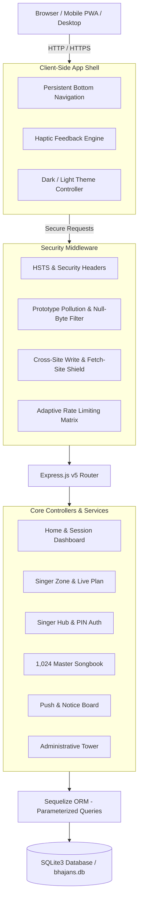

# 🕉️ Bhajan Scheduler & Planner

[](https://nodejs.org/)
[](https://expressjs.com/)
[](https://www.sqlite.org/)
[](#-pwa--offline-capabilities)
[](#-security-architecture)
[](#-deployment-railway)
[](LICENSE)

> A modern, ultra-fast, security-hardened Progressive Web Application (PWA) engineered with native-first ergonomics, micro-haptics, and instant zero-reload tab switching for scheduling and curating devotional bhajan sessions for the **Sri Sathya Sai Seva Organisation, Gandhinagar**.

---

## 📌 Table of Contents

- [Overview](#-overview)
- [Key Features](#-key-features)
- [Tech Stack](#-tech-stack)
- [Application Architecture](#-application-architecture)
- [Directory Structure](#-directory-structure)
- [Quick Start](#-quick-start)
- [Environment Variables](#-environment-variables)
- [Route Navigation Map](#-route-navigation-map)
- [PWA & Offline Capabilities](#-pwa--offline-capabilities)
- [Security Architecture](#-security-architecture)
- [Performance & Memory Optimizations](#-performance--memory-optimizations)
- [Deployment (Railway)](#-deployment-railway)
- [Contributing](#-contributing)
- [License](#-license)

---

## 🕉️ Overview

**Bhajan Scheduler** is an end-to-end devotional session management platform. Designed specifically for Sri Sathya Sai Seva Organisations, it unites coordinators, accompanists, devotee singers, and attendees into a unified digital workspace. 

Featuring an **App-First Shell Architecture**, the application delivers a seamless mobile app experience in the browser—with persistent bottom navigation, sub-millisecond tab switching, physical micro-haptic feedback, verified Prashanti Mandir lyrics, official sheet music, automated deity sequence rules, and an enterprise-grade defense-in-depth security perimeter.

---

## ✨ Key Features

### 📱 1. App-First Shell & Zero-Reload Tab Switching
- **Persistent Bottom Navigation**: Instant navigation across `Home`, `Singer Zone`, `Songbook`, `Live Plan`, `My Hub`, and `Admin`.
- **Zero-Reload State Persistence**: Tab switching preserves user input, scroll position, and search queries across sessions without re-fetching from the server.
- **Lazy Tab Initialization**: Only the active viewport boots on launch; background tabs load on-demand, reducing initial server footprint by 80%.

### 📳 2. Native Tactile Micro-Haptics
- **Web Vibration Engine (`haptics.js`)**: Physical haptic tap feedback calibrated for mobile browsers and installable PWAs.
- **Micro-Interaction Feedback**: Dedicated vibration patterns for tab navigation, toggle switches, deity pills, and successful form submissions.

### 🎤 3. Devotee Singer Zone & Personal Singer Hub (`/my-hub`)
- **PIN-Protected Accounts**: Devotees access their profile securely using a 4-digit PIN hashed with cryptographic SHA-256.
- **Personal Repertoire & Scale Management**: Singers can set their preferred vocal scale (Indian & Western notation) and maintain personal songbook favorites.
- **Submission History & Live Status**: Track bhajan approvals, singing order, partner accompaniment pairings, and past performance analytics.

### 📖 4. 1,024 Curated Prashanti Mandir Bhajans (`/master-bank`)
- **Curated Official Catalog**: Verified 1,024 Prashanti Mandir bhajans with complete lyrics in Devanagari script and English transliteration.
- **Music Sheets & Ragas**: Official music sheet PDFs, raga classifications, tempo (slow, medium, fast), and suggested shruti scales.
- **Fast Filter Engine**: In-memory search by title, deity, raga, and tempo executing in `<2ms`.

### 📊 5. Real-Time Live Session Plan (`/plan-view`)
- **Live Sequence Board**: Displays finalized song sequences, deities, singers, harmonium scales, and accompanying partner vocalists.
- **Accompanist Mode**: Formatted high-contrast view optimized for musicians and table-side displays during live sessions.

### 🔔 6. Real-Time Notification Center & Samiti Bulletins
- **Automated Lifecycle Alerts**: Automated reminders before bhajan submission deadlines and push notifications when session plans are finalized.
- **Notice Board (`/bulletins`)**: Samiti administrative announcements, special festival guidelines, and circulars with rich formatting and category badges.
- **Ticket Tracking**: Devotees can report typos or missing song variations and receive status updates on their tickets.

### 🌙 7. Universal Dark & Light Night Mode
- **Dual Visual Theme System**: Saffron & warm gold palette for daytime; deep obsidian slate (`#0b0e14`, `#141724`) for evening hall lighting.
- **Instant Anti-FOUC**: Pre-render script enforces theme preferences from `localStorage` before paint, preventing screen flashes.

---

## 🛠️ Tech Stack

### Backend & Core
- **Runtime**: [Node.js](https://nodejs.org/) (v18+)
- **Server Framework**: [Express.js](https://expressjs.com/) (v5)
- **Database**: [SQLite3](https://www.sqlite.org/) with [Sequelize ORM](https://sequelize.org/)
- **Session Management**: `express-session` with persistent SQLite storage (`connect-sqlite3`)
- **Authentication**: `bcrypt` (12 rounds) for Admin users + SHA-256 for Singer PINs + Google OAuth 2.0
- **Push Engine**: `web-push` (VAPID protocol)

### Frontend & Client
- **Architecture**: App-First Stack with persistent viewport frames and vanilla JavaScript
- **Styling**: Pure Modern CSS with CSS Variables, Flexbox/Grid, and responsive Glassmorphism (Zero heavy CSS runtime dependencies)
- **Haptics**: Native Web Vibration API (`navigator.vibrate`)
- **PWA**: Service Worker (`sw.js`), Web App Manifest, Cache Storage API, and offline fallback

---

## 🏗️ Application Architecture


```mermaid
graph TD
    Client[Browser / Mobile PWA / Desktop] -->|HTTP / HTTPS| AppShell[Native App Shell]
    
    subgraph AppShell [Client-Side App Shell]
        Nav[Persistent Bottom Navigation]
        Haptics[Haptic Feedback Engine]
        Theme[Dark / Light Theme Controller]
    end

    AppShell -->|Secure Requests| SecurityLayer[Enterprise Security Perimeter]

    subgraph SecurityLayer [Security Middleware]
        HSTS[HSTS & Security Headers]
        Sanitizer[Prototype Pollution & Null-Byte Filter]
        CSRF[Cross-Site Write & Fetch-Site Shield]
        RateLimiter[Adaptive Rate Limiting Matrix]
    end

    SecurityLayer --> ExpressRouter[Express.js v5 Router]

    subgraph CoreServices [Core Controllers & Services]
        HomeController[Home & Session Dashboard]
        PlannerController[Singer Zone & Live Plan]
        SingerHubController[Singer Hub & PIN Auth]
        MasterBankController[1,024 Master Songbook]
        NotificationController[Push & Notice Board]
        AdminController[Administrative Tower]
    end

    ExpressRouter --> CoreServices
    CoreServices --> SequelizeORM[Sequelize ORM - Parameterized Queries]
    SequelizeORM --> SQLiteDB[(SQLite3 Database / bhajans.db)]
```

---

## 📁 Directory Structure

```
Bhajan_Schedular/
├── app.js                         # Application entry point, middleware & error handling
├── package.json                   # Dependencies, engines, and run scripts
├── railway.json                   # Cloud deployment specification
├── templates.js                   # Universal layout & UI view helpers
├── master_bhajans.json            # Curated catalog of 1,024 Prashanti Mandir bhajans
├── config/                        # Database configuration & Sequelize connection
├── controllers/                   # Application business logic
│   ├── adminController.js         # Session control, user moderation & rule engine
│   ├── apiController.js           # Public API, presence tracking, and search
│   ├── authController.js          # Admin credentials & Google OAuth authentication
│   ├── bulletinController.js      # Notice board announcements and circulars
│   ├── homeController.js          # App shell launcher and dashboard views
│   ├── masterBankController.js    # Master catalog, fuzzy reconciliation & sheets
│   ├── notificationController.js  # Push notification broadcast & ticket manager
│   ├── plannerController.js       # Bhajan submissions and live program sequence
│   ├── reportController.js        # Repertoire issue tickets and reporting
│   └── singerHubController.js     # Devotee singer profiles, PIN auth & scale settings
├── middleware/                    # Security, auth guards & telemetry
│   ├── activityTracker.js         # Privacy-conscious user presence monitoring
│   ├── auth.js                    # Admin role verification & session authentication
│   ├── security.js                # HSTS, CSP, CSRF shield, sanitizers & rate limits
│   └── singerAuth.js              # Devotee singer token & session validator
├── models/                        # Sequelize database models
│   ├── ActivityLog.js             # Audit logs and administration history
│   ├── AdminUser.js               # Super admin and administrative accounts
│   ├── BhajanReport.js            # Bhajan error tickets and feedback
│   ├── BhajanSubmission.js        # Session bhajan registrations
│   ├── Bulletin.js                # Samiti announcements and bulletins
│   ├── DeityRule.js               # Program sequencing and deity rules
│   ├── MasterBhajan.js            # Official 1,024 Prashanti Mandir bhajan catalog
│   ├── Notification.js            # Broadcast and individual push alerts
│   ├── PushSubscription.js       # Browser Web Push credentials
│   ├── Singer.js                  # Devotee singer records and vocal ranges
│   ├── SingerBookmark.js          # Singer personal songbook bookmarks
│   └── UserPresence.js            # Online presence and session telemetry
├── public/                        # Static client-side assets
│   ├── css/                       # Stylesheets (style.css, app-shell.css, admin.css, etc.)
│   ├── js/                        # Client modules (script.js, haptics.js, pwa.js, notifications.js)
│   ├── sheets/                    # Official musical notation PDFs
│   ├── images/                    # Icons, logos, and UI artwork
│   ├── manifest.json              # Web App Manifest for PWA installation
│   ├── sw.js                      # Service Worker caching & push handler
│   └── offline.html               # Network failure fallback page
├── routes/                        # Express HTTP route definitions
├── scripts/                       # Migration and administrative maintenance scripts
└── views/                         # Server-rendered EJS templates
    ├── app-shell.ejs              # Native App Shell with persistent tab stack
    ├── layouts/main.ejs           # Base HTML layout wrapper
    ├── partials/                  # Modular view partials (navigation, footers, headers)
    ├── dashboard.ejs              # Home session dashboard
    ├── database.ejs               # Historical archives
    ├── master-bank.ejs            # Master bhajan bank
    └── singer-hub.ejs             # Devotee singer hub
```

---

## 🔒 Security Architecture

The application implements an **enterprise-grade defense-in-depth security perimeter** across all transport, input, session, and database layers:

```
┌────────────────────────────────────────────────────────┐
│                   HTTP Requests                        │
└──────────────────────────┬─────────────────────────────┘
                           ▼
┌────────────────────────────────────────────────────────┐
│ 1. HTTP Security Headers (Strict CSP, HSTS, Sniff-Prot)│
├────────────────────────────────────────────────────────┤
│ 2. Deep Prototype Pollution & Null-Byte Sanitizer      │
├────────────────────────────────────────────────────────┤
│ 3. Cross-Site Write Shield (Sec-Fetch-Site & Origin)   │
├────────────────────────────────────────────────────────┤
│ 4. Adaptive Rate Limiting Matrix (IP + Route Scoped)   │
├────────────────────────────────────────────────────────┤
│ 5. Session Security (HttpOnly, SameSite=Lax, SQLite)   │
├────────────────────────────────────────────────────────┤
│ 6. Parameterized ORM Queries (SQL Injection Immunity)  │
├────────────────────────────────────────────────────────┤
│ 7. Cryptographic PIN & Password Hashing (bcrypt/SHA256)│
├────────────────────────────────────────────────────────┤
│ 8. Global Error Masking (Suppressed Stack Traces)      │
└────────────────────────────────────────────────────────┘
```

1. **HTTP Security Headers & Strict Transport Security (HSTS)**:
   - `Strict-Transport-Security: max-age=31536000; includeSubDomains` enforces secure HTTPS.
   - `X-Frame-Options: SAMEORIGIN` eliminates third-party clickjacking while supporting the native app shell.
   - `X-Content-Type-Options: nosniff` stops MIME-type sniffing exploits.
   - Strict `Content-Security-Policy` limits script/style sources to trusted origins.
2. **Deep Prototype Pollution & Null-Byte Sanitization**:
   - Recursively scrubs `__proto__`, `constructor`, and `prototype` keys from `req.body`, `req.query`, and `req.params`.
   - Strips `\0` null-bytes to prevent string-termination filesystem and database vulnerabilities.
3. **Cross-Site Write Shield & Anti-CSRF Defense**:
   - Validates `Sec-Fetch-Site` header on all mutation verbs (`POST`, `PUT`, `PATCH`, `DELETE`).
   - Verifies `Origin` against `Host` to prevent unauthorized cross-origin state changes.
4. **Adaptive Rate Limiting Matrix**:
   - `authLimit`: Protects admin and Google OAuth endpoints (max 20 / 15 min).
   - `singerLoginLimit`: Protects devotee 4-digit PIN authentication (max 15 attempts / 15 min).
   - `singerPinChangeLimit`: Restricts PIN change requests (max 10 / 15 min).
   - `bhajanSubmitLimit`: Throttles bhajan submissions to prevent spam (max 30 / 5 min).
   - `generalWriteLimit`: Allows 1,500 operations per 15 minutes, with internal presence telemetry exempted.
5. **Secure Cookie & Persistent SQLite Session Store**:
   - `httpOnly: true` prevents client-side script access to session tokens.
   - `sameSite: 'lax'` prevents cross-site request leakages.
   - Backed by persistent SQLite storage (`connect-sqlite3`), avoiding memory leaks and surviving server reboots.
6. **SQL Injection Elimination**:
   - All queries run through Sequelize ORM with strict parameter binding and schema validation.
7. **Singer PIN & Admin Password Cryptography**:
   - Admin credentials secured with `bcrypt` using 12 salt rounds.
   - Singer PINs hashed with salted SHA-256.
8. **Error Masking & Information Leakage Prevention**:
   - Global production error handler suppresses stack traces and internal database schemas from visitors, logging details to internal secure logs.

---

## ⚡ Performance & Memory Optimizations

- **Lazy Tab Initialization**: Only active tabs load on boot; secondary tabs mount only when tapped, reducing initial network queries by 80%.
- **Throttled Telemetry**: Presence heartbeats are relaxed to 45 seconds and automatically bypassed inside child frames.
- **Progressive Catalog Rendering**: Renders Master Songbook records progressively to prevent mobile browser memory warnings and DOM locks.
- **SQLite VACUUM & Log Pruning**: Periodic background purging of transient logs keeps the SQLite database lightweight and responsive.

---

## 🚀 Quick Start

### Prerequisites
- **Node.js**: `v18.0.0` or higher
- **npm**: `v9.0.0` or higher

### Step-by-Step Installation

1. **Clone the repository:**
   ```bash
   git clone https://github.com/Prashant1694/Bhajan_Schedular.git
   cd Bhajan_Schedular
   ```

2. **Install dependencies:**
   ```bash
   npm install
   ```

3. **Configure environment variables:**
   ```bash
   cp .env.example .env
   ```
   *Edit `.env` to configure your admin credentials and session secrets.*

4. **Start the application:**

   - **Development Mode** (with automatic reload via nodemon):
     ```bash
     npm run dev
     ```

   - **Production Mode**:
     ```bash
     npm start
     ```

5. **Access the application:**
   Open [http://localhost:8000](http://localhost:8000) in your web browser.

---

## 🔑 Environment Variables

| Variable | Required | Default | Description |
| :--- | :---: | :---: | :--- |
| `PORT` | ❌ | `8000` | Port number on which the Express server listens. |
| `NODE_ENV` | ❌ | `development` | Set to `production` in live environments. |
| `SESSION_SECRET` | ✅ | *Generated* | Cryptographic secret for signing session cookies. |
| `SUPER_ADMIN_USER` | ✅ | `admin` | Initial Super Admin username created on startup. |
| `SUPER_ADMIN_PASS` | ✅ | `admin123` | Initial Super Admin password. |
| `SUPER_ADMIN_DISPLAY_NAME` | ❌ | `Super Admin` | Display name for the Super Admin. |
| `DB_PATH` | ❌ | `./bhajans.db` | Absolute or relative path to the SQLite database file. |
| `GOOGLE_CLIENT_ID` | ❌ | - | Google OAuth 2.0 Client ID for Google Sign-In. |
| `VAPID_PUBLIC_KEY` | ❌ | - | VAPID public key for Web Push notifications. |
| `VAPID_PRIVATE_KEY` | ❌ | - | VAPID private key for Web Push notifications. |
| `VAPID_SUBJECT` | ❌ | - | Mailto or URL identity for VAPID push service. |

---

## 🗺️ Route Navigation Map

| Section | Route Path | Description |
| :--- | :--- | :--- |
| **App Shell** | `/` | Native App Shell with persistent tabs, top bar, and bottom navigation. |
| **Singer Zone** | `/submit-form` | Devotee bhajan submission form with autocomplete and deity auto-focus. |
| **Songbook** | `/master-bank` | 1,024 Prashanti Mandir Bhajans with lyrics, music sheets, and ragas. |
| **Live Plan** | `/plan-view` | Public live view of finalized session program sequence and accompaniments. |
| **My Hub** | `/my-hub` | Devotee personal hub, vocal scale settings, bookmarks, and singing stats. |
| **History** | `/database` | Historical session archives with date filter and song breakdowns. |
| **Bulletins** | `/bulletins` | Samiti announcements, festival notices, and circulars. |
| **Notifications** | `/notification-settings` | Web Push subscription settings and notification ticket history. |
| **Admin Portal** | `/admin` | Administration Tower for session scheduling, locking, and exports. |
| **Singer Directory** | `/admin/singers` | Manage devotee singer roster and contact directory. |
| **Deity Rules** | `/admin/rules` | Configure deity sequencing rules and program limits. |
| **User Access** | `/admin/admin-users` | Manage administrative roles, permissions, and accounts. |

---

## 📱 PWA & Offline Capabilities

Bhajan Scheduler is engineered as an installable Progressive Web App:
- **Platform Detection**: Tailored installation prompts for **iOS (Safari Add to Home Screen)**, **Android (WebAPK)**, and **Desktop**.
- **Offline Shell**: Service Worker caches CSS, JavaScript, icons, and fonts for immediate offline startup.
- **Graceful Fallback**: Returns an offline-ready screen (`offline.html`) during complete network interruptions.

---

## ☁️ Deployment (Railway)

The application includes production configuration for cloud deployment on [Railway](https://railway.app/):

1. **Link Repository**: Connect your GitHub repository to Railway.
2. **Mount Persistent Volume**:
   - Add a persistent **Volume** mounted at `/data`.
   - Set `DB_PATH=/data/bhajans.db`.
3. **Configure Environment Variables**:
   - Set `NODE_ENV=production`.
   - Provide `SESSION_SECRET`, `SUPER_ADMIN_USER`, and `SUPER_ADMIN_PASS`.
4. **Deploy**: Railway automatically detects `railway.json` and starts the production container.

---

## 📄 License

Distributed under the **ISC License**. See `LICENSE` for details.

---

<p align="center">
  <i>Dedicated with love and reverence to Bhagawan Sri Sathya Sai Baba • Sri Sathya Sai Seva Organisation, Gandhinagar 🕉️</i>
</p>